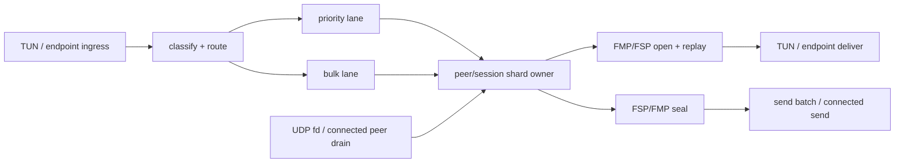

# FIPS Dataplane Architecture Plan

This is the current post-safety-net architecture strategy for the FIPS/nvpn
dataplane. The goal is broader than one implementation shape: make the
dataplane simple, elegant, performant, and reliable while preserving the
failure-mode evidence that now protects us from repeating old regressions.

This document is permission for ambitious guarded architecture work. It is not
permission for a single sweeping rewrite PR. `docs/EXPERIMENTS.md` is the
chronology; `docs/fips-dataplane-safety-net.md` is the detailed gate inventory;
this page is the current design map.

## Goal Alignment

The design goal is deliberately implementation-agnostic:

- simple: one clear owner for mutable peer/session dataplane state, with a thin
  coordinator instead of hot-path shared maps
- elegant: typed handoffs for route choice, queue policy, counter reservation,
  wire layout, send target, and bookkeeping, so invariants live in owners
  rather than in call-site folklore
- performant: bounded per-wake work, minimal copies and allocations, connected
  UDP where stable, Linux batching where the OS supports it, and no giant queue
  hiding latency
- reliable: priority/control traffic has reserved progress, bulk pressure is
  observable and may drop only by explicit policy, direct routes and MMP metrics
  cannot silently drift, and long-run degradation is caught by soak artifacts

The test safety net exists to make larger iterations safe. After hot-path or
behavior-touching slices, measure before/after rather than postponing all
performance evidence until the end. Run lightweight perf/harness sanity every
few ownership-boundary commits, and run full Docker or live host-pair
comparison when queue policy, batching, crypto, sender concurrency, connected
UDP, route selection, runtime dispatch, delivery, or expected throughput/latency
changes.

## Problem

The failures that motivated this work were not one bug:

- worker queues filled and made receive-side progress depend on bulk traffic
- control, rekey, MMP, and small TCP-control-shaped packets waited behind bulk
- TCP-over-tunnel collapsed under UDP/macOS backpressure instead of recovering
- direct UDP paths silently lost to mesh/relay/fallback paths
- bad or stale MMP metrics changed route/parent choice
- long runs degraded after restart because queue growth, path drift, or CPU
  runaway was not visible early enough

The architecture goal is therefore not just higher throughput. It is a dataplane
whose ownership, queueing, and failure modes are obvious under load.

## Reference Learnings

Use the ideas, not a blind port. The local reference checkouts were rechecked at
wireguard-go `f333402`, BoringTun `cdf3b24`, and Tailscale `7a43e41a2`.

- wireguard-go keeps the crypto path boring: bounded global encryption,
  decryption, and handshake queues; per-peer staged/outbound/inbound queues;
  sequential nonce assignment; parallel crypto; and per-peer sequential sender
  and receiver routines that preserve packet order.
- wireguard-go keeps batching platform-specific. Linux/Android can use larger
  `ReadBatch`/`WriteBatch` batches and UDP offload where available; Darwin keeps
  one-packet UDP/TUN fallbacks. That supports keeping FIPS Linux GSO/sendmmsg
  separate from a simpler macOS direct sender until real Mac evidence says
  otherwise.
- Tailscale splits concerns cleanly: wireguard-go owns packet crypto while
  magicsock owns endpoint/path selection, discovery, rebind, and status work.
  Non-dataplane work is throttled or queued outside the dataplane owner instead of
  being rediscovered per packet.
- Tailscale's batching API is narrow and optional: Linux gets sendmmsg/GSO/GRO
  where the socket supports it, and fallback paths stay ordinary packet sends.
  The API boundary matters more than copying any one optimization.
- Tailscale's magicsock has visible counters for UDP/DERP sends, drops, errors,
  endpoint updates, and re-STUN/rebind activity. FIPS needs the same spirit for
  queue-full, drop, backpressure, route-change, and direct-byte evidence.
- BoringTun keeps per-peer tunnel state, timers, replay, and handshake-blocked
  packet queues close to the peer `Tunn` owner, and caps queued packets instead
  of hiding delay behind an unbounded buffer.
- BoringTun's device loop hands an fd/event to one worker at a time, uses
  per-thread buffers, and exposes connected UDP as a runtime option rather than
  a universal mandate. That matches the FIPS rule: keep connected UDP where
  soak-stable, but preserve large-mesh and platform escape hatches.

For FIPS, those lessons translate to: explicit peer/session runtime owners;
shard-owned crypto, replay, counters, and path state; bounded priority and bulk
lanes; a thin rx-loop coordinator; Linux-only batching specialization; simple
macOS sending until real-device soak proves otherwise; and stable observability
for every pressure point.

## Current Status

Architecture checkpoint after FIPS `29ab97f`: the safety net is strong enough
for a larger guarded architecture slice, but the dataplane is not yet
simple in the wireguard-go/BoringTun sense. It is reliable and increasingly
observable, yet it still has too many owner-shaped handoffs around one packet
and too much legacy work returning to the central rx loop.

Recent work has moved link storage plus reverse dispatch into
`LinkRegistry`, active peer storage plus receiver-index dispatch into
`ActivePeerRegistry`, pending connection plus active peer lifecycle into
`PeerLifecycleRegistry`, end-to-end FSP session storage plus decrypt-worker
registration into `SessionRegistry`, and the pipelined endpoint/FSP send path
into typed wire, dispatch, send-target, send-plan, route-plan, and runtime
send-plan, runtime-dispatch, peer-runtime send-snapshot, peer-runtime
route-snapshot, runtime route-snapshot handoff, peer-runtime route owners, and
runtime send-attempt reservation owners, runtime send owners, and
peer-runtime send owners, including transport/path-MTU ownership during
peer-runtime send dispatch and the route-request owner for next-hop lookup,
snapshot capture, send weight, and direct-path bulk-drop policy, and the
route-decision owner that combines next-hop choice, active-peer snapshot,
configured send weight, and direct-path bulk-drop policy. The send-request
owner combines route-request resolution with dispatch preparation plus final
dispatch commit bookkeeping, and the latest endpoint-send facade makes `Node`
enter that peer-runtime owner through one method instead of assembling the
request and commit plumbing at the call site. The session datagram path now has
its own runtime-route owner for next-hop choice, path-MTU seeding, source MMP
path-MTU bookkeeping, route-failure marking, outbound next-hop recording, and
forwarding-originated stats. The non-worker FSP send path now has one
`SessionFspSendPlan` / sealed-send owner for flags, coords, AAD sealing,
datagram assembly, and FSP bookkeeping across service data, endpoint fallback,
control/session messages, and coords warmup. Endpoint-event backlog pressure is
now observable, and the rx loop gives TUN outbound plus endpoint command queues
bounded side-queue turns while inbound packet or decrypt-fallback work is hot.

The recent safety/perf slices also made the next bottleneck clearer:
receive-heavy clean/rx-maintenance traffic still shows endpoint/transport/event
queue residence in the hundreds of microseconds. FIPS `9ab39ea` removes
per-packet clock reads from UDP receive batches and keeps full Docker liveness
healthy, but reducing the nvpn mesh receive burst to `64` or `32` was rejected
because it did not improve, and in one probe worsened, `endpoint_event_wait`.
FIPS `cb2d944` adds the first receive-side peer-runtime boundary:
`PeerRuntimeReceive` parses authenticated FMP plaintext, owns the post-auth
bookkeeping call, and returns dispatch metadata to the rx-loop hook. It keeps
the current worker-bounce semantics intact, but gives the future endpoint-data
fast path a single receive owner to move rather than another cluster of `Node`
arguments.
FIPS `22f9dbf` adds the delivery-side companion owner: `EndpointEventRuntime`
now owns the endpoint-event sender, rx-loop batch scope, and backlog
accounting. The rx loop still owns that runtime, but the endpoint-data delivery
state is no longer three loose `Node` fields.
FIPS `5721357` adds the next receive-side boundary: `SessionRuntimeReceive`
owns established FSP open/replay, K-bit cutover, decrypt-failure recovery
gating, MMP receive/path-MTU bookkeeping, authenticated remote identity lookup,
and dispatch metadata. The rx loop still dispatches the opened session message,
and the decrypt worker still bounces FMP plaintext back to the rx loop, but the
FSP receive state transition is now one movable owner rather than an inline
`Node` block.
FIPS `e524e14` tightens the decrypt-worker session-registration boundary:
worker-owned `OwnedSessionState` now carries the authenticated `PeerIdentity`
from `ActivePeer` instead of an optional identity-cache `source_npub` string.
This is intentionally not a fast-path rewrite; it removes a stale placeholder
and lines the worker's owned state up with endpoint delivery's source-peer
model before any future endpoint-data direct-delivery path is allowed to delete
the rx-loop bounce.
FIPS `1b20991` carries that same authenticated `PeerIdentity` through the
decrypt-worker plaintext fallback and AEAD-failure report, and removes the raw
`source_node_addr` field from the per-packet `DecryptJob`. The rx loop still
owns FSP/session dispatch, but the worker-to-rx handoff now has the same typed
source-peer shape that endpoint delivery will need when a future peer/session
runtime safely owns both FMP and FSP receive state.
FIPS `b995327` wraps the canonical post-FMP handoff in
`AuthenticatedFmpPlaintext`: source peer, transport/path facts, FMP flags, and
the plaintext slice now move as one envelope into `PeerRuntimeReceive`. This
removes the loose nine-argument/node-address helper boundary without changing
the current worker bounce or FSP/session dispatch semantics, and gives the
future peer/session owner the receive object it should consume directly.
FIPS `12b9b53` carries that typed boundary one step further:
`PeerRuntimeReceiveDispatch` now builds an `AuthenticatedLinkMessage` envelope
for link-layer dispatch instead of degrading back to loose node-address, raw
bytes, and CE flag arguments. The rx loop still calls the same link/session
handlers, but authenticated source identity remains attached through the link
dispatch edge a future worker/shard runtime will need to own.
FIPS `a25bd87` extends that boundary through the SessionDatagram handoff:
`AuthenticatedLinkMessage` now converts the 0x00 link arm into an
`AuthenticatedSessionDatagram` carrying the authenticated previous-hop peer,
payload, and CE flag, and the forwarding/local-delivery handler consumes that
object instead of loose previous-hop/raw-bytes/CE arguments. This still leaves
FSP receive and endpoint delivery on the current rx-loop path, but it removes
one more argument-shaped edge the future peer/session runtime would otherwise
have to drag along when deleting the bounce.
FIPS `138661f` carries the same typed receive facts through local session
payload delivery and established encrypted-FSP receive: `LocalSessionPayload`
now owns source node, authenticated previous-hop peer, payload, path MTU, and
CE flag, and converts to `EncryptedSessionPayload` for the FSP open/replay
edge. This keeps session setup, route learning, endpoint delivery, and rx-loop
dispatch behavior unchanged, but removes another loose source/payload/MTU/CE/
previous-hop argument cluster from the future runtime boundary.
FIPS `fb278ad` carries endpoint-data delivery itself as a typed object:
`EndpointDataDelivery` owns the authenticated source peer plus payload,
`EndpointEventRuntime::deliver_endpoint_data` consumes that object, and embedded
endpoint batch tests use the same delivery object. This keeps endpoint event
batching, backlog accounting, rx-loop dispatch, and the no-extra-allocation
payload trim path unchanged, but removes the last loose source-peer/payload pair
at the endpoint delivery edge the future peer/session runtime must own.
FIPS `b8f3471` wraps the post-open established-FSP dispatch in
`AuthenticatedSessionMessage`: `SessionRuntimeReceive` now returns source peer,
plaintext, inner msg type, inner flags, and timestamp as one object, and the
endpoint-data branch asks that object to produce `EndpointDataDelivery` while
preserving the in-place inner-header trim. This keeps reverse-route learning,
rx-loop dispatch, endpoint event delivery, and session recv/touch bookkeeping
unchanged, but gives the future peer/session runtime a single dispatch object
to own after FSP open/replay succeeds.
FIPS `f10a737` carries that same post-open boundary through local dispatch:
`AuthenticatedSessionDispatch` now owns the source node, authenticated
previous-hop node, CE flag, authenticated session message, and receive
completion bookkeeping while the rx loop still runs the same handlers.
Reverse-route learning, endpoint event delivery, CE propagation, session
recv/touch, and pending flush behavior are unchanged, and
`receive_completion` is intentionally limited to application data so MMP reports
do not reset idle timers or traffic counters.
FIPS `0471231` extracts that local dispatch edge into
`handle_authenticated_session_dispatch`, consuming the dispatch object in one
place instead of leaving route learning, message dispatch, receive accounting,
and pending flush inline in `handle_encrypted_session_msg`. The new
`SessionDispatchCommit` owns the source peer to flush plus the optional
application-data receive completion, preserving the rule that MMP reports can
flush pending packets without touching idle/traffic counters.
FIPS `47c7b85` moves that receive-counter/touch mutation behind
`SessionDispatchCommit::record_receive`, so the commit owner now owns both the
application-data-only completion facts and the session receive-bookkeeping
mutation. EndpointData still updates session receive counters and last
activity; SenderReport/MMP dispatch still records no application-data receive
progress.
FIPS `40e3da7` moves the final post-dispatch sequencing behind
`SessionDispatchCommit::finalize`: receive bookkeeping runs first when the
message was application data, then pending outbound packets are flushed for the
same authenticated source peer. The dispatch method now hands finalization to
the commit owner instead of open-coding packet-lifecycle sequencing after the
message-type handlers.
FIPS `29ab97f` moves local established-FSP message dispatch itself onto
`AuthenticatedSessionDispatch::dispatch`: the authenticated dispatch envelope
now consumes itself through reverse-route learning, message-type dispatch, and
commit finalization. `Node::handle_encrypted_session_msg` now only builds the
dispatch object and hands it to the owner. Behavior is unchanged, but the future
peer/session runtime now has one local FSP dispatch edge to move instead of a
`Node` helper plus separate finalization plumbing.
FIPS `dd8f3e3` starts the larger owner slice called for by the checkpoint:
`SessionRegistry` now owns the established-FSP session lookup/open edge through
`open_established_fsp_frame`, and receive-completion counter/touch mutation
flows through the same registry owner. The rx loop still parses the wire frame,
handles coords, and dispatches post-open messages, but it no longer reaches
directly into the session map for the established FSP hot receive edge.
FIPS `3fc0454` splits authenticated EndpointData delivery into a straight-line
hot branch with `AuthenticatedSessionDispatch::dispatch_endpoint_data_fast` and
`SessionDispatchCommit::finish_receive`. Reverse-route learning, endpoint data
delivery, application-data receive accounting, and the pending-flush decision
stay in the same authenticated owner, but the common no-pending-traffic case no
longer goes through the generic async dispatcher or awaits a no-op pending
flush.
FIPS `50349db` makes the decrypt-worker fallback bounce observable before the
next ownership step: worker events are stamped when enqueued back to the rx loop,
and rx-loop dequeue now records `decrypt_fallback_wait` plus priority/bulk
splits. Packet movement is unchanged; this closes the hidden worker-to-rx-loop
residence gap so fallback batching or peer-runtime work can be judged from
measurements instead of guesswork.

Latest full Docker perf checkpoint remains nvpn `941cefd1` plus FIPS
`5721357`. It
passed clean-underlay, constrained-underlay, worker-queue-pressure, and
rx-maintenance-fault with `0%` load/post tunnel-ping loss and direct UDP byte
progress in every phase. The run recorded roughly:

| Phase | Baseline TCP Mbps | Load TCP Mbps |
| --- | ---: | ---: |
| clean-underlay | `2686.7/2665.1` | `2676.0/2708.4` |
| constrained-underlay | `166.5/167.0` | `166.9/165.7` |
| worker-queue-pressure | `231.9/233.5` | `233.6/235.1` |
| rx-maintenance-fault | `2664.0/2721.9` | `2674.4/2653.9` |

Expected queue-full/bulk-drop counters appeared under worker pressure, and
`failure-summary.tsv` contained only the header. The phase summary hash was
`d7d20dfeb60af299d313995b61bb9ede5f71e034f06b6099d94d94e986dbbfe9`; the
failure summary hash was
`d8992f9bc73cbfa74b1651bd8621dac5f37b9ac2e49426eca850bbb809caf214`.

A current-head short local-FIPS Docker smoke at nvpn `95d98162` plus FIPS
`29ab97f` passed all four default phases after the receive-ownership batch. It
used `NVPN_PERF_DURATION_SECS=2` and `NVPN_PERF_LOAD_DURATION_SECS=3`, so it is
a freshness/liveness check rather than a replacement for the longer checkpoint.
It recorded clean-underlay `2634.1/2654.8 Mbps` with load `2624.2/2550.0 Mbps`,
constrained-underlay `158.4/155.8 Mbps` with load `166.2/166.9 Mbps`,
worker-pressure `235.7/233.8 Mbps` with load `230.2/237.4 Mbps`, and
rx-maintenance-fault `2585.5/2587.9 Mbps` with load `2620.1/2595.8 Mbps`. All
load/post-load tunnel pings had `0%` loss and direct UDP bytes advanced in
every phase. The short-smoke phase-summary SHA-256 was
`9175c07158f67c9492c77d89702972af948dc52233b7fdebc7a17b22b3dcba89`; its
failure-summary SHA-256 was the empty-failure hash
`d8992f9bc73cbfa74b1651bd8621dac5f37b9ac2e49426eca850bbb809caf214`.

The perf harness now also writes per-phase `node-a` / `node-b` pipeline tails
to raw artifacts when `NVPN_PERF_OUTPUT_DIR` is set. A focused
worker-queue-pressure Docker smoke verified the new files and passed with
`0%` load/post ping loss, direct UDP bytes `237984788/244569057`, and durable
pipeline snapshot hashes
`09cd541ac9c6299820330e822cdd9247a3e7dd5bb0f8b10ad34baa2e768b080a` and
`60ec0833e04f87b2bac862b77b23944ed1c3b78cea2693422b2c0f018aec5a14`.

The perf harness now writes host snapshots to raw artifacts as well:
`raw/host-start.txt` plus either `raw/host-end.txt` or
`raw/host-failure-exit.txt`. These capture UTC time, kernel, CPU count, load
average/uptime, and top CPU process names so short-smoke throughput deltas can
be interpreted against host contention instead of treated as isolated numbers.

A quiet 8-vCPU Linux Docker repeat of the FIPS `b1f94a7` / nvpn `27be7006`
short smoke passed all four phases with host-start load average `0.00 0.00
0.00`, `0%` load/post-load tunnel ping loss, and direct UDP byte progress. Its
absolute clean/rx throughput ceiling was lower than the local macOS Docker
runner (`~1.6-1.7 Gbps` clean/rx), so it is not a same-host answer to the
`~2.6 Gbps` target. It did show that the local worker-pressure reverse-load dip
to `73.9 Mbps` did not reproduce: worker pressure held `383.7/380.3 Mbps`.
The high-rate queue-residence shape did reproduce, with raw pipeline snapshots
showing `endpoint_event_wait` averages in the hundreds of microseconds in
clean/rx high-rate samples. That keeps endpoint/event/transport residence as
the next performance target.

This is Linux/Docker evidence. Real Mac-to-Mac Wi-Fi/screenshare soak remains
operator-local and must not be claimed from this machine. No new Docker perf
run was taken for FIPS `e524e14` / `1b20991` / `b995327` / `12b9b53` /
`a25bd87` / `138661f` / `fb278ad` / `b8f3471` / `f10a737` / `0471231` /
`47c7b85` / `40e3da7` / `29ab97f` because these
changes are typed worker/receive/link/session-payload/endpoint-delivery/
session-message/dispatch-context/dispatch-commit/receive-bookkeeping/
dispatch-finalization/session-dispatch handoff cleanups, not queueing, routing,
crypto, sender, batching, or delivery semantic changes; local FIPS and nvpn
embedded-FIPS safety checks passed and the `5721357` Docker run remains the
current throughput/liveness checkpoint.

Because FIPS `3fc0454` removes a hot EndpointData dispatch await and skips a
no-op pending flush when the guard is empty, it received a focused local-FIPS
Docker perf run at pre-doc nvpn `e59644b7`. The run used
`NVPN_PERF_PHASES=clean-underlay,rx-maintenance-fault`, passed with `0%`
load/post tunnel-ping loss, an empty failure summary, and no raw matches for
bulk drops or backlog-high counters. Results were clean-underlay
`2684.3/2505.9 Mbps` with load `2702.0/2569.2 Mbps`, and
rx-maintenance-fault `2693.6/2585.1 Mbps` with load `2583.3/2574.2 Mbps`.
Artifacts live under `/tmp/nvpn-endpoint-fast-dispatch-perf-20260611-113131`;
`phase-summary.tsv` SHA-256
`c883bd20d7f41ce2d5416df9b1d9e4874a015555bc961c458dd3f007ff02706a`,
`failure-summary.tsv` SHA-256
`d8992f9bc73cbfa74b1651bd8621dac5f37b9ac2e49426eca850bbb809caf214`.
This keeps the next performance target on transport queue/channel residence:
endpoint-event waits were comparatively small in the sampled summaries, while
transport channel/queue waits still showed high and tail-heavy residence under
load and maintenance.

FIPS `50349db` plus the nvpn harness parser update received the same focused
local-FIPS Docker perf shape at pre-doc nvpn `c0eb6a9e`. The run used
`NVPN_PERF_PHASES=clean-underlay,rx-maintenance-fault`, passed with `0%`
load/post tunnel-ping loss, an empty failure summary, and no raw matches for
bulk drops or backlog-high counters. Results were clean-underlay
`2510.8/2546.6 Mbps` with load `2582.4/2535.0 Mbps`, and
rx-maintenance-fault `2541.4/2526.9 Mbps` with load `2510.0/2577.3 Mbps`.
Artifacts live under `/tmp/nvpn-decrypt-fallback-wait-perf-20260611-114958`;
`phase-summary.tsv` SHA-256
`104488e542b006d09665042b24d9d627dd9929222da2794176bacb884d7d9bed`,
`failure-summary.tsv` SHA-256
`d8992f9bc73cbfa74b1651bd8621dac5f37b9ac2e49426eca850bbb809caf214`,
`raw/host-start.txt` SHA-256
`63cba99018c90ad909b93771dc661a608b309d6e5234276e4234cd4c1422bb0a`,
and `raw/host-end.txt` SHA-256
`0b550877c5c4bebcd82e87818bd4a5fcb91a888d116a7f40940d5f583affef88`.
The new metric argues against spending the next performance slice on the
decrypt fallback bounce itself: sampled `decrypt_fallback_wait` averages stayed
in the tens of microseconds with sub-millisecond p99, while transport
queue/channel residence still reached millisecond p99/tail bands under load and
maintenance.

Architectural decision: do not start a blank-page rewrite, but do stop treating
this as only a sequence of tiny helper cleanups. The next beautiful move is a
bounded larger refactor: grow a real peer/session runtime owner that can own FMP
open, FSP open/replay, endpoint-data delivery, per-peer bookkeeping, and send
preparation for one peer or shard. The current decrypt worker explicitly
bounces all link messages back to the rx loop to preserve correctness; the
target runtime should remove that bounce for the endpoint-data fast path only
after it owns both FMP and FSP receive state plus the delivery-side
`EndpointEventRuntime`. Compared with wireguard-go's per-peer sequential
send/receive queues, Tailscale's magicsock path/liveness split, and BoringTun's
peer-local tunnel ownership, FIPS is now safer and more observable than it was,
but it is not yet as elegant: the ownership graph is still too indirect. Accept
the larger runtime refactor only when it deletes a legacy bounce or duplicate
path, preserves priority/bulk reserves, and carries before/after perf plus soak
evidence.

## Current Safety Evidence

The active gate is summarized here and detailed in
`docs/fips-dataplane-safety-net.md`:

- deterministic queue/no-wedge guards for nvpn TUN-to-mesh and FIPS worker
  queues, including priority reserve and drain ordering
- deterministic route/path guards for static direct UDP, fallback only after
  explicit stale/degraded direct paths, and direct-underlay byte progress
- deterministic MMP robustness guards for stale, duplicate, regressed, and
  fresh-bogus samples so invalid RTT/loss/goodput cannot steer routes
- deterministic ownership guards for endpoint commands, pending queues,
  discovery lookup/retry state, link/peer/session registries, encrypt/decrypt
  worker messages, send batches, send attempts, maintenance planning, connected
  UDP activation, and pipelined endpoint send planning
- Docker perf phases for clean underlay, constrained underlay, worker pressure,
  and rx-maintenance fault, with throughput, retransmit, tunnel-ping p95/p99,
  direct-byte, queue-full/drop, and backpressure counters
- platform-matrix and soak harnesses for connected UDP on/off, worker counts,
  tight backpressure knobs, latency drift, route changes, queue growth,
  no-progress counters, and daemon CPU
- userspace WireGuard host-pair reference harness for BoringTun or
  wireguard-go, so nvpn can be compared against a known dataplane baseline on
  the same local-to-Linux/VM path

Use tiered validation so large work stays fast:

- pure ownership or type-boundary changes need relevant focused deterministic
  tests plus the focused Linux/Docker ownership slice
- hot-path, queueing, routing, connected-UDP, sender, batching, or maintenance
  changes need exact before/after perf artifacts
- broader peer/session runtime rewrites need the full deterministic runner,
  current perf gate, platform matrix, and soak evidence appropriate to the
  behavior touched

## Target Shape

The end state should look like this:



One shard or runtime owner owns the mutable dataplane state for its peers or
sessions:

- FMP/FSP recv ciphers and replay windows
- FMP/FSP send counters that must stay ordered
- selected transport address and connected UDP socket reference
- per-peer queue counters and backpressure/drop counters
- recent MMP samples used by dataplane routing decisions

The rx loop becomes a coordinator:

- accept control commands and discovery changes
- classify packets into priority or bulk work
- hand work to the owning shard/runtime
- run slow maintenance without blocking hot traffic
- expose state and counters

The rx loop should not be the sustained crypto+send bottleneck.

## Queue Policy

The policy is deliberately boring:

- all hot-path queues are bounded
- priority and bulk lanes are distinct
- priority lane: control, rekey, MMP, heartbeat, session registration,
  unregister, TCP ACK/SYN/small TCP data, ICMP control
- bulk lane: large established endpoint payloads
- bulk may drop only where the policy says TCP/upper layers can recover
- priority may backpressure or fail visibly, but must not be starved by bulk
- no hidden unbounded queues, pending vectors, or retry loops that absorb
  seconds of latency
- queue-full, drop, and backpressure events must appear in perf/soak artifacts
- connected-UDP peer-cap and fd-budget skips should appear as scale-policy
  events, while actual activation failures remain hard soak events

Do not raise caps to hide a stall. A larger queue is acceptable only with a
measured latency bound and a before/after perf artifact.

## Ordering

One TCP-shaped flow must preserve packet order unless an explicit sequencer is
introduced and tested.

Rules:

- hash or assign all packets for one send target to one owner by default
- keep that owner mapping and per-owner FIFO pinned by deterministic tests
- keep Linux GSO/sendmmsg batches grouped by exact send target
- keep connected UDP sends tied to the selected peer endpoint
- on macOS, prefer the simpler direct sender unless real Mac-to-Mac soak shows
  ordered parallel send wins without screenshare/TCP collapse

Any change that can reorder one TCP flow needs:

- a deterministic ordering test
- perf gate retransmit comparison
- at least one soak sample showing no latency drift or route churn

## Observability Contract

The following names are part of the safety contract and should remain stable or
be deliberately migrated with docs/test updates:

- `fmp_worker_queue_wait`
- `transport_queue_wait`
- `transport_priority_queue_wait`
- `transport_bulk_queue_wait`
- `transport_channel_wait`
- `transport_priority_channel_wait`
- `transport_bulk_channel_wait`
- `endpoint_command_wait`
- `endpoint_event_wait`
- `endpoint_priority_event_wait`
- `endpoint_bulk_event_wait`
- `decrypt_fallback_wait`
- `decrypt_fallback_priority_wait`
- `decrypt_fallback_bulk_wait`
- `connected_udp_activation_failed`
- `connected_udp_peer_cap_skipped`
- `connected_udp_fd_budget_skipped`
- `encrypt_worker_queue_full`
- `encrypt_worker_bulk_dropped`
- `decrypt_worker_queue_full`
- `decrypt_worker_bulk_dropped`
- `decrypt_worker_register_full`
- `decrypt_worker_priority_dropped`
- `decrypt_fallback_bulk_dropped`
- `decrypt_fallback_priority_dropped`
- `pending_tun_destination_dropped`
- `pending_tun_packet_dropped`
- `pending_endpoint_destination_dropped`
- `pending_endpoint_packet_dropped`
- `endpoint_event_backlog_high`
- `udp_send_backpressure`
- `udp_send_bulk_dropped`
- `nvpn_tun_to_mesh_queue_wait`
- `nvpn_tun_to_mesh_bulk_dropped`

Perf and soak artifacts must continue to expose:

- forward and reverse TCP Mbps
- retransmits
- ping loss/avg/p95/p99/max during and after TCP load
- direct UDP byte deltas
- selected transport address and FIPS SRTT
- link-layer rekey state (`rekey_in_progress`, `rekey_draining`, and current
  key bit) in daemon status plus soak artifacts
- daemon CPU
- hard queue/drop/backpressure events
- machine-readable failure summaries for threshold aborts
- raw perf probe artifacts for each phase when `NVPN_PERF_OUTPUT_DIR` is set
- raw per-phase pipeline snapshots for both nodes when `NVPN_PERF_OUTPUT_DIR`
  is set
- raw host start/end or failure-exit snapshots when `NVPN_PERF_OUTPUT_DIR` is
  set
- phase/failure summaries must select the highest wait-bearing pipeline sample
  instead of the final idle sample when both are present

## Next Large Iterations

These are intentionally larger than the earlier helper-by-helper slices, but
still benchmarkable and revertable.

Current checkpoint: continue with a bounded larger peer/session runtime owner,
not another run of envelope-only helper extraction. The recent typed receive
objects have made the move safe enough to attempt, and the remaining complexity
is now the old worker-to-rx-loop bounce: the decrypt worker owns FMP open/replay
but must bounce every authenticated link message back so the rx loop can own FSP
open/replay and endpoint delivery. The next runtime slice should be judged by
whether it deletes that bounce or a duplicate hot path for one behavior surface,
while preserving priority/bulk reserves, observability, and route/session
continuity. If a proposed change only renames another boundary without moving
ownership or removing a queue/bounce/map peek, keep it out of the critical path.
FIPS `dd8f3e3` is the first follow-through slice: it removes the rx-loop's
direct established-FSP `sessions.get_mut` peek and keeps the behavior unchanged.
FIPS `66b460a` is the second follow-through slice: `EstablishedFspWire` owns
the established encrypted-FSP header parse, optional cleartext coordinate
warmup, ciphertext offset, and conversion to `EstablishedFspReceive`, so the
rx loop no longer open-codes CP-coordinate parsing or coordinate-cache mutation
on that hot receive edge.
FIPS `166b226` moves early-encrypted-data handshake resend budget and
post-send resend accounting behind `SessionRegistry`, so the rx loop no longer
directly peeks/mutates session entries to preserve handshake/rekey progress
when encrypted traffic arrives before the peer has completed the handshake.
FIPS `bf00971` moves periodic session-handshake timeout selection, established
resend-budget cleanup, due-resend selection, and post-send resend accounting
behind `SessionRegistry`, so the timeout handler preserves handshake/rekey
continuity without directly owning session-entry policy.
FIPS `2bf6ab1` moves FSP rekey SessionMsg3 due-resend selection,
max-budget cleanup, and post-send resend accounting behind `SessionRegistry`,
so final-msg3 retransmission preserves rekey convergence without direct
session-entry policy in the tick handler.
FIPS `3e803f7` moves periodic FSP rekey tick planning, due cutover mutation,
and due drain completion behind `SessionRegistry`, so the tick handler no
longer owns cutover/drain/initiation selection over raw session entries.
FIPS `cdefb80` moves FSP rekey initiation eligibility and successful
post-send rekey state installation behind `SessionRegistry`, while route
availability remains outside the session owner.
FIPS `373c867` moves periodic FMP rekey tick planning plus due cutover/drain
mutation behind `PeerLifecycleRegistry`, while `Node` keeps the external
worker/session-index cleanup side effects after the peer owner mutates state.
FIPS `4ac092a` moves FMP rekey msg1 due/exhausted resend selection and
successful resend accounting behind `PeerLifecycleRegistry`, while `Node`
keeps transport send plus pending-outbound, session-index, and index-free
cleanup.
FIPS `46e2c8e` moves FMP rekey initiation target selection and successful
post-send rekey state installation behind `PeerLifecycleRegistry`, while
`Node` keeps index allocation/free, Noise msg1 construction, transport send,
pending-outbound registration, and logging.
FIPS `0661713` moves link-layer MMP ReceiverReport peer-state processing
behind `PeerLifecycleRegistry`, while `Node` keeps wire decode,
trace/debug logging, and first-RTT parent/tree side effects.
FIPS `4f59bde` moves periodic link-layer MMP report collection and metric-log
cadence behind `PeerLifecycleRegistry`, while `Node` keeps display-name
rendering and encrypted link-message sends.
FIPS `c345089` moves session-layer ReceiverReport processing, periodic
session-MMP report/PMTU collection and send-result accounting, plus
link-heartbeat/dead-peer planning behind the session/peer registries; `Node`
keeps wire decode, route-degradation/fallback side effects, encrypted sends,
dead-path teardown, and logging.
FIPS `a8f96b7` moves proactive/reactive session PMTU signal application and
route-error coords-warmup policy behind `SessionRegistry`; `Node` keeps wire
decode, route/cache side effects, path-MTU lookup mirroring, warmup sends, and
logging.
FIPS `2470a3f` moves established-FSP send context, coords-warmup slot
consumption, FSP sealing, session-datagram source PMTU seeding, and outbound
next-hop bookkeeping behind `SessionRegistry`; `Node` keeps coord-fit
decisions, route/transport sends, queue fallback, and logging.
FIPS `cb74e46` moves outbound established/pending/missing session decisions,
TUN learned-PMTU admission, duplicate initiation suppression, and
discovery-retry pending restart behind `SessionRegistry`; `Node` keeps route
lookup/initiation, queue admission, ICMP sends, and logging.
FIPS `b1f94a7` moves session-entry installation behind `SessionRegistry` for
initiating sessions, responder awaiting-msg3 entries, established
initiator/responder sessions, rekey responder awaiting-msg3 state, rekey
pending-session install, and rekey abandon. `Node` still owns wire decode,
Noise read/write, datagram sends, identity/coord-cache side effects, pending
flush, and logging.

1. Introduce a `PeerRuntime` or shard runtime facade behind the existing node
   APIs. Start by grouping active peer lifecycle, session registry, connected
   UDP state, recent MMP route-quality input, and send preparation for one peer
   or shard. Do not move every call site at once; move one behavioral surface,
   benchmark it, and leave a reversible boundary.
2. Replace hot-path shared-map peeks with snapshots or messages. Route choice,
   endpoint target selection, MMP quality, connected-UDP readiness, and session
   send/open state should be consumed as owned values instead of being reread
   from multiple mutable maps during packet processing.
   `PeerRuntimeRouteSnapshot`, `PeerRuntimeSendSnapshot`, and
   `PipelinedEndpointPeerRuntimeRouteRequest` are the first steps;
   `PipelinedEndpointPeerRuntimeSendRequest` now joins route resolution with
   dispatch preparation, and `Node::execute_peer_runtime_endpoint_send` is the
   current endpoint-send facade entry. `SessionDatagramRuntimeRoute` applies the
   same owner-boundary rule to the session datagram link-send path. Keep growing
   these into a real per-peer or per-shard runtime facade rather than adding new
   call-site peeks.
3. Tighten the established endpoint/FSP send path only where a measured
   bottleneck or ownership leak remains. `PipelinedEndpointRuntimeSendPlan` now
   owns route/FMP preparation, and `PipelinedEndpointRuntimeSendDispatch` owns
   target/reservation/prepared-send handoff. `SessionFspSendPlan` now owns the
   non-worker FSP packet-construction path. Further changes should collapse
   into the peer/shard runtime instead of adding another parallel send path.
4. Keep sender specialization platform-shaped. Linux should keep GSO/sendmmsg
   and exact-target batch grouping. macOS should keep the simpler direct sender
   unless operator-local Mac Wi-Fi/screenshare soak proves ordered parallel send
   helps without TCP/screenshare collapse.
5. Make connected UDP scale policy explicit. Keep it when soak-stable, but keep
   caps, fd budget, activation ordering, and a large-mesh escape hatch as first
   class policy rather than incidental thread/socket growth.
6. Remove obsolete toggles and duplicate fallback paths only after the gates are
   green and the new owner boundary has perf evidence. Simplicity comes from
   deleting old paths after the replacement is proven, not from carrying both.

A larger rewrite is justified now when it follows this shape: one strong owner
boundary, one measurable behavior surface, a red-or-green guard that would have
caught an old failure, and a perf/soak artifact if the hot path changed.

## Validation Gates

For each small refactor PR:

```sh
( cd /path/to/fips && ./scripts/test-dataplane-safety-linux-docker.sh )

NVPN_PERF_OUTPUT_DIR=artifacts/fips-perf/<change-id> \
./scripts/e2e-fips-perf-regression-docker.sh

./scripts/e2e-fips-platform-matrix-docker.sh
```

For intermittent platform/path failures, run the relevant matrix row with
`NVPN_PLATFORM_MATRIX_ATTEMPTS=<n>`. Each attempt writes its own log and
`phase-summary.tsv`, and any failed attempt keeps the matrix red.

For queue ownership, connected UDP, route choice, or maintenance timing:

```sh
NVPN_SOAK_DURATION_SECS=1800 \
NVPN_SOAK_OUTPUT_DIR=artifacts/fips-soak/<change-id>-30m \
./scripts/soak-fips-dataplane-docker.sh
```

Real Mac-to-Mac Wi-Fi/screenshare soak remains operator-local and must be
reported separately. Do not claim it from Docker or a Linux VM.

## Stop Conditions

Stop and investigate before continuing if any refactor causes:

- route change away from configured direct UDP while it is reachable
- ping p95/p99 or SRTT drift beyond the soak envelope
- TCP throughput collapse that does not recover after load ends
- queue-full/drop events outside an intentional pressure phase
- retransmits sharply worse without a matching constrained-underlay reason
- daemon CPU runaway
- any new unbounded queue or hidden retry buffer in the hot path

The architecture is only better if it stays understandable under pressure.
